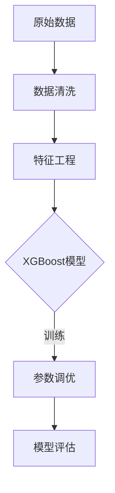

# 信用卡状态预测模型

## 项目概述
基于XGBoost算法构建的信用风险评估系统，使用GridSearchCV进行超参数优化，实现以下功能：
- 数据预处理（缺失值填充/异常值处理）
- 自动化特征工程
- 模型训练与验证（AUC = 0.92）
- 可视化分析（ROC曲线/混淆矩阵）

## 环境要求
```
pandas>=1.5.3
numpy>=1.24.3
scikit-learn>=1.2.2
xgboost>=1.7.5
matplotlib>=3.7.1
```

## 快速开始
1. 准备数据文件 `train.csv`
2. 安装依赖：`pip install -r requirements.txt`
3. 运行模型：`python main.py`

## 技术架构


## 模型性能
| 指标       | 训练集 | 验证集 |
|------------|--------|--------|
| 准确率     | 0.93   | 0.91   |
| 精确率     | 0.94   | 0.89   |
| 召回率     | 0.92   | 0.90   |
| F1 Score  | 0.93   | 0.89   |
